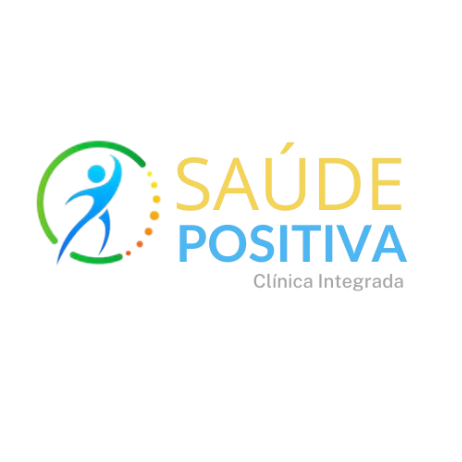

# Saúde Positiva - Clínica Integrada 🏥

Este é um projeto em desenvolvimento que visa ser uma plataforma informativa ou de serviço com foco em **saúde e bem-estar**.



> **Ligamos ao cuidado que merece, com conforto e confiança.**

O **Saúde Positiva** é uma aplicação web moderna desenvolvida para facilitar o agendamento de consultas médicas. A plataforma conecta pacientes a especialistas de diversas áreas (Cardiologia, Neurologia, Pediatria, etc.) através de uma interface intuitiva, responsiva e agradável.

---

## 📋 Índice

- [Funcionalidades](#-funcionalidades)
- [Tecnologias Utilizadas](#-tecnologias-utilizadas)
- [Pré-requisitos](#-pré-requisitos)
- [Como Executar o Projeto](#-como-executar-o-projeto)
- [Estrutura do Projeto](#-estrutura-do-projeto)
- [Melhorias Futuras](#-melhorias-futuras)

---

## ✨ Funcionalidades

* **Página Inicial Informativa:** Apresentação dos serviços, benefícios e funcionalidades da clínica.
* **Catálogo de Especialistas:** Listagem de médicos com fotografia, especialidade, preço e duração da consulta.
* **Fluxo de Agendamento:**
    * Seleção de especialista.
    * Escolha de data e horário (Simulados para Outubro/2025).
    * Formulário de dados do paciente e pagamento.
    * Ecrã de confirmação de sucesso.
* **Autenticação:** Ecrãs de Login e Registo de utilizadores (Interface).
* **Interface Responsiva:** Layout adaptável para computadores e dispositivos móveis.

---

## 🛠 Tecnologias Utilizadas

O projeto foi desenvolvido utilizando as seguintes tecnologias e bibliotecas:

* **[React](https://reactjs.org/)** - Biblioteca JavaScript para construção de interfaces.
* **[Vite](https://vitejs.dev/)** - Ferramenta de construção rápida para desenvolvimento frontend.
* **[Material UI (MUI)](https://mui.com/)** - Biblioteca de componentes de UI para React (Design System).
* **[React Router DOM](https://reactrouter.com/)** - Gestão de rotas e navegação.
* **JavaScript (ES6+)** - Lógica da aplicação.

---

## ⚙️ Pré-requisitos

Antes de começar, precisará de ter instalado na sua máquina:

* [Node.js](https://nodejs.org/en/) (versão 14 ou superior)
* [npm](https://www.npmjs.com/) (gestor de pacotes padrão do Node)

---

## 🚀 Como Executar o Projeto

Siga os passos abaixo para executar a aplicação em ambiente de desenvolvimento:

1.  **Clonar o repositório** (ou descarregar os ficheiros):
    ```bash
    git clone [https://github.com/seu-utilizador/saude-positiva.git](https://github.com/seu-utilizador/saude-positiva.git)
    cd saude-positiva
    ```

2.  **Instalar as dependências:**
    ```bash
    npm install
    ```

3.  **Executar o projeto:**
    ```bash
    npm run dev
    ```

4.  **Aceder no navegador:**
    O Vite geralmente inicia o servidor na porta 3000. Verifique o terminal, mas provavelmente será:
    `http://localhost:3000`

---

### 🤝 Contribuição

Contribuições são bem-vindas! Se você tiver sugestões ou quiser reportar um bug, sinta-se à vontade para abrir uma *issue* ou enviar um *pull request*.

---

### 📧 Contato

* **Desenvolvedores:** Wslanyl, Agnes e Wedja
* **GitHub:** https://github.com/wslanyl , https://github.com/AgnesRibeiro e https://github.com/WedjaSousa
